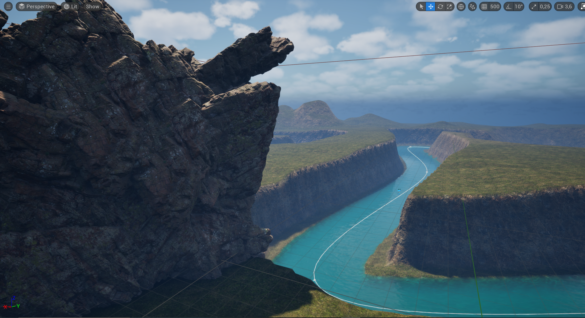
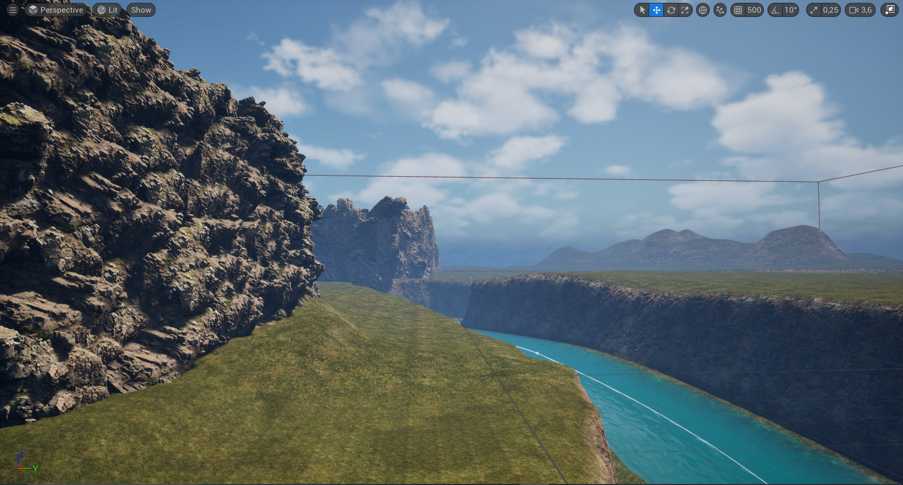
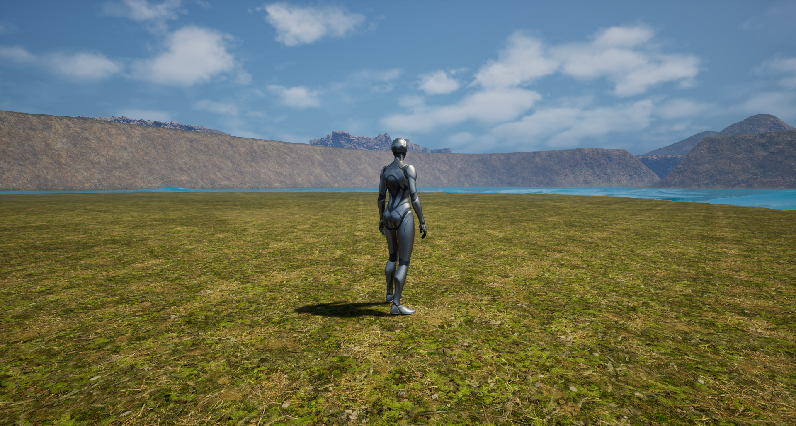
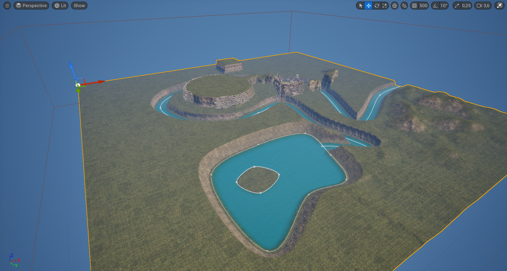

# 🗺️ Unreal Engine 3D Map

This is a small personal project I'm working on to practice building 3D worlds in Unreal Engine—possibly for a future game. It's still in the early stages, but I wanted to document my progress and share some visuals along the way. The main goals are to improve my skills in level design, world interaction, and general game systems.

## Screenshots & GIFs

## Tools Used

- **Engine:** Unreal Engine 5.x  
- **Language:** C++  
- **Art Assets:** FAB (Unreal Engine’s asset marketplace)

## Notes

This isn't meant to be a finished game—just a sandbox for learning and experimenting. I'm documenting things here to track progress and showcase some of the work while I apply for internships.

Due to GitHub's free storage limitations, I'm keeping this repo lightweight and mostly focused on visuals and written documentation rather than uploading full project files.
